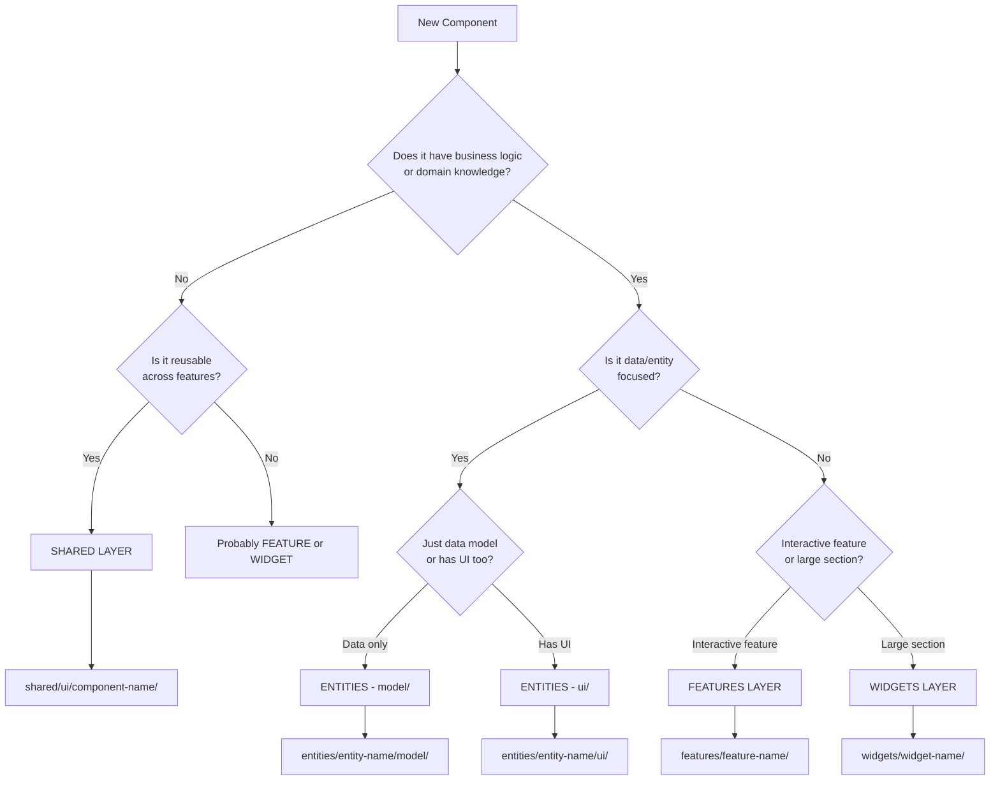

# Component Placement Guide

Use this decision tree to determine where a component belongs in the FSD architecture.

## Decision Flow



## Quick Classification

### → Shared Layer

**Indicators**:
- ✅ Generic, reusable UI component
- ✅ No business logic
- ✅ Could be used in any project
- ✅ No domain knowledge

**Examples**:
- `Badge`, `Button`, `LinkButton`, `SectionContainer`
- `Avatar`, `SocialPill`, `TitleSection`
- Generic form inputs, modals, tooltips

**Not Shared**:
- ❌ `ProjectCard` - domain-specific (belongs in widget)
- ❌ `UserProfile` - entity-specific (belongs in entity)
- ❌ `LoginForm` - feature-specific (belongs in feature)

### → Entities Layer

**Indicators**:
- ✅ Represents business entity/domain model
- ✅ Has data structure
- ✅ Used across multiple features
- ✅ Minimal interaction logic

**Examples**:
- `entities/project/` - Project data and types
- `entities/user/` - User data and types
- `entities/badge/` - Badge data models
- `entities/technology/` - Technology tags

**Structure**:
```
entities/project/
├── model/
│   ├── types.ts          # TypeScript interfaces
│   └── data.ts           # Hardcoded data
├── ui/                    # Entity-specific UI (optional)
│   └── ProjectCard.astro
└── index.ts
```

### → Features Layer

**Indicators**:
- ✅ User interaction/action
- ✅ Can be toggled on/off
- ✅ Has client-side logic
- ✅ Single responsibility

**Examples**:
- `features/theme-toggle/` - Toggle dark/light theme
- `features/language-picker/` - Switch language
- `features/search/` - Search functionality
- `features/auth/` - Authentication flow

**Not a Feature**:
- ❌ `Projects` - Display section (widget)
- ❌ `ProjectData` - Data model (entity)
- ❌ `Button` - Generic UI (shared)

### → Widgets Layer

**Indicators**:
- ✅ Composes multiple features/entities
- ✅ Large, complex component
- ✅ Represents a page section
- ✅ Combines business logic

**Examples**:
- `widgets/header/` - Site header with nav, theme, language
- `widgets/hero/` - Hero section with avatar, social
- `widgets/experience/` - Experience list section
- `widgets/projects/` - Projects showcase

**Widget Characteristics**:
- Uses components from `shared`, `entities`, `features`
- Often has internal components (not exported)
- Represents a visual section of a page

## Common Scenarios

### Scenario: "I need a ProjectCard component"

**Question**: What does it do?

**Answer A**: "Displays project data with title, description, tags"
→ **Widget** (`widgets/projects/ui/components/ProjectCard.astro`)
→ Internal to Projects widget, not exported

**Answer B**: "Just shows a project entity with basic info"
→ **Entity UI** (`entities/project/ui/ProjectCard.astro`)
→ Can be reused by different widgets

**Decision Factors**:
- Does it have widget-specific styling/layout? → Widget internal component
- Is it generic display of entity? → Entity UI
- Could multiple widgets use it differently? → Entity UI

### Scenario: "I need a ContactForm component"

**Question**: What's its purpose?

**Answer A**: "Form with validation, submission, state management"
→ **Feature** (`features/contact-form/`)
→ Has business logic, user interaction

**Answer B**: "Generic form layout with inputs"
→ **Shared** (`shared/ui/form/`)
→ No business logic, reusable

### Scenario: "I need to display user experience"

**Question**: What does it include?

**Answer A**: "Data model: company, title, dates, description"
→ **Entity Model** (`entities/experience/model/`)

**Answer B**: "Full section with timeline, multiple items, styling"
→ **Widget** (`widgets/experience/`)
→ Uses experience entity data

**Answer C**: "Single experience entry display"
→ **Entity UI** (`entities/experience/ui/ExperienceItem.astro`)
→ Can be used by widget

## Special Cases

### Internal Components

Components used ONLY inside a widget should be in `ui/components/`:

```
widgets/experience/
├── ui/
│   ├── Experience.astro           # Exported
│   └── components/
│       └── ExperienceItem.astro   # NOT exported, internal only
└── index.ts                        # Only exports Experience
```

### Data Extraction

If a widget has hardcoded data:

```astro
<!-- ❌ Before -->
<!-- widgets/projects/ui/Projects.astro -->
---
const PROJECTS = [{ id: 1, title: 'Project' }]; // Hardcoded data
---

<!-- ✅ After -->
<!-- entities/project/model/data.ts -->
export const PROJECTS = [{ id: 1, title: 'Project' }];

<!-- widgets/projects/ui/Projects.astro -->
import { PROJECTS } from '@entities/project';
```

### Assets Organization

**Global assets** → `shared/assets/icons/`
**Entity-specific** → `entities/technology/assets/icons/`
**Widget-specific** → `widgets/hero/assets/background.jpg`

## Validation Checklist

Before finalizing component placement:

- [ ] Component has clear single responsibility?
- [ ] No import violations (importing from higher layers)?
- [ ] Public API created (`index.ts`)?
- [ ] Path alias configured?
- [ ] Types extracted to `/model/types.ts`?
- [ ] Data extracted to `/model/data.ts` (if entity)?
- [ ] Internal components in `ui/components/` (if widget)?

## Migration Examples

### Example 1: Badge Component

**Analysis**:
- Generic UI component ✅
- No business logic ✅
- Reusable ✅
- No domain knowledge ✅

**Placement**: `shared/ui/badge/`

**Structure**:
```
shared/ui/badge/
├── Badge.astro
└── index.ts
```

### Example 2: Projects Section

**Analysis**:
- Displays project entities ✅
- Composes LinkButton (shared) ✅
- Large section component ✅
- Uses project data (entity) ✅

**Placement**: `widgets/projects/`

**Structure**:
```
widgets/projects/
├── ui/
│   └── Projects.astro
└── index.ts
```

**Imports**:
```astro
import { PROJECTS } from '@entities/project';
import { LinkButton } from '@shared/ui/link-button';
```

### Example 3: ThemeToggle

**Analysis**:
- User interaction ✅
- Client-side logic ✅
- Stateful (localStorage) ✅
- Can be toggled ✅

**Placement**: `features/theme-toggle/`

**Structure**:
```
features/theme-toggle/
├── model/
│   └── types.ts
├── ui/
│   └── ThemeToggle.astro
└── index.ts
```
